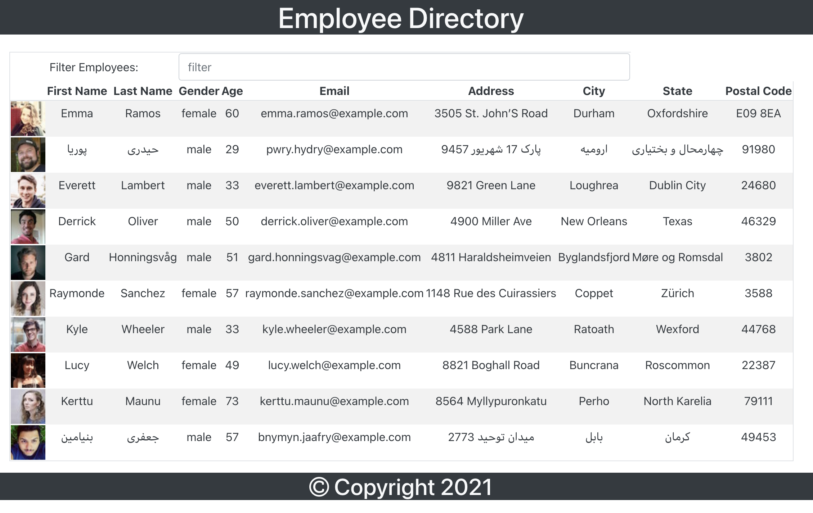

# JY Employee Directory

## Description
This Project uses React to provide a simple mock employee directory.  User sort the employees by clicking the column header, they may also filter by typing in the filter input box.
## Table of Contents
* [`Project`](#)
* [`Description`](#Description)
* [`Table of Contents`](#Table-of-Contents)
* [`1nstallation Steps`](#Installation-Steps)
* [`Usage Information`](#Usage-Information)
* [`Testing`](#Testing)
* [`License`](#License)
* [`Contributing`](#Contributing)
* [`Questions`](#Questions)
* [`Sample`](#Sample)
## Installation Steps
To install this project, do the following:
> 1. To Install on "localhost", clone repository to local workspace.
> 2. In a terminal, in project base directory, run "npm install" to install dependencies.
> 3. Run "npm run start" to start the application.
> NOTE: You may need to change the URL under API.js to use a proxy to prevent CORS error.

## Usage Information
To use this project, do the following:
> 1. Ensure Installation Steps have been complete.
> 2. For localhost, open browser and browse to URL http://localhost:3000
> 3. You may sort employees by clicking the headings, and you may filter by typing in the filter input box.

## Testing
To test this project, do the following:
> 1. To test on localhost, Ensure Installation steps are complete
> 2. Verify Working on localhost, by performing Usage Steps
> 3. To test app in github pages follow directions under: https://create-react-app.dev/docs/deployment/#github-pages

## License
This project is provided under the None license. For more information on license details click here 
## Contributing
If you wish to contribute, do the following:
> Email me directly or submit pull request to contribute.
## Questions
If you have any question about this repo, you may open an issue or contact me directly at jyoung7223@yahoo.com
You can find more of my work at [My Github Repo](https://github.com/JYoung7223 "My GitHub Repo")
## Sample
Deployed project can be found at: https://jyoung7223.github.io/jy_employee_directory/

Below is a sample screenshot:

